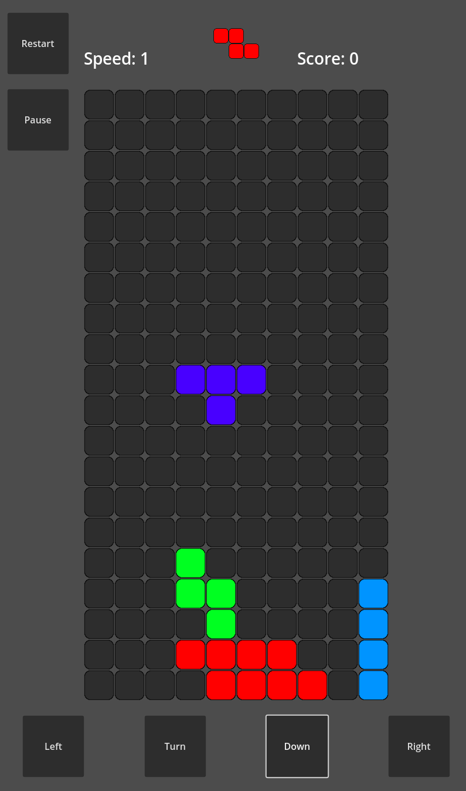

# Godot-tetris
Tetris clone that I made with GDScript.

## Overview

## Using
You can use the buttons or keyboard keys to control the tetromino.

### Install
- Download Godot4
- Specify the path to the game folder
